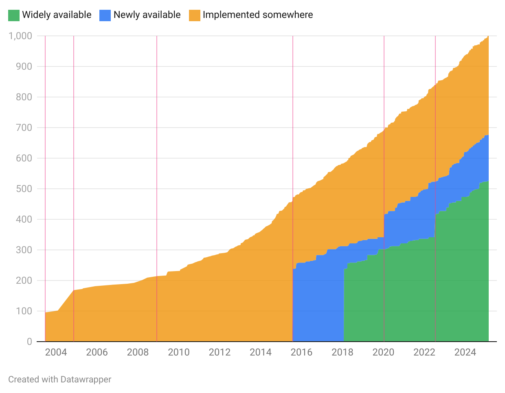
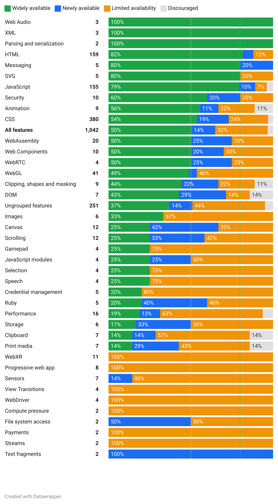
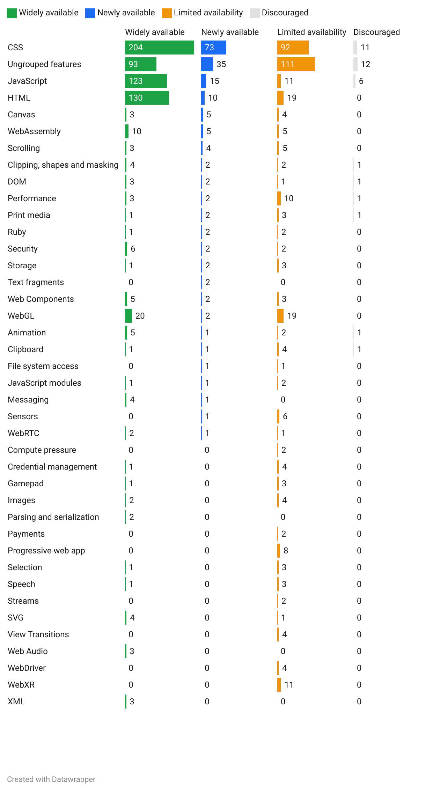
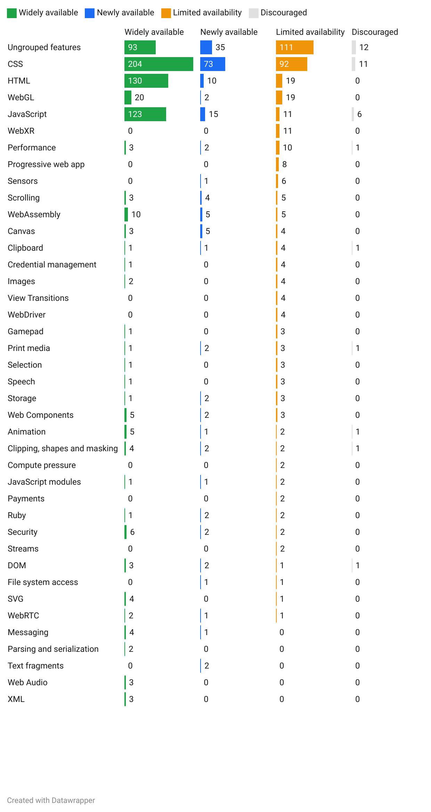

# Exploring visualizations of web-features

This repository contains CSV files with statistics computed from [web-features](https://github.com/web-platform-dx/web-features), PNG exports of corresponding graphs generated through [Datawrapper](https://www.datawrapper.de/), and the Node.js script used to produce the CSV files and graphs.

Goal is to explore possible visualizations of the catalog of features in web-features and assess whether these visualizations tell us something useful about the web platform as seen from main browsers.

**Note:** The files and graphs are not automatically updated and may well be out of sync with the web-features catalog when you read this! Check last modification dates.


## How to run the script

### Clone the repository and install dependencies:

```
git clone https://github.com/tidoust/web-features-viz.git
cd web-features-viz
npm install
```

### Run the script

```
node index.mjs
```

This should update the CSV files in the `csv` folder, ready to be injected in some graph rendering library or service.

The script attempts to update and re-publish Datawrapper graphs if it gets run with a `--graphs` argument, updating the PNG exports in the `graphs` folder. This requires a Datawrapper API token set in a local `config.json` file and, more importantly, this **will not work** on your machine because the Datawrapper graphs are under my account (the graph IDs are hardcoded in the script).

You should be able to generate graphs yourself from the CSV files using Datawrapper or your favorite graph library or service.

**Note:** CSV files use `;` as separator.

## Generated CSV files and graphs

### Timelines

**Note:** ~50 features have support dates that start with `≤` in web-features to indicate that support started before these dates. This nuance is dropped to compute statistics. This makes features appear later than they should when looking at the evolution of the number of web features, and reduces the duration from first implementation to newly available. Impact should remain minimal and I believe underlying dates are all before mid-2020.

#### Evolution of the number of web features

The [`timeline-number.csv`](csv/timeline-number.csv) file contains the evolution of the number of web features over time per Baseline type.

Columns:
- `Date`: The date in format `YYYY-MM-DD`. Dates that appear in the file are typically dates at which a new version of some browser was released.
- `Widely available`: The number of widely available features at that date.
- `Newly available`: The number of newly available (but not widely available) features at that date
- `Implemented somewhere`: The number of features that were implemented in at least one browser (but not available in all browsers) at that date.

**Note:** Features that have not shipped anywhere are not associated with any date in web-features and do not appear in the CSV file. As of January 2025, 32 features (out of 1000+ features) are in that category.

The resulting Datawrapper graph shows the [evolution of the number of web features](https://datawrapper.dwcdn.net/iIjGw/1/) that compose the web platform (see PNG export below). The graph needs to be read with care, especially the first half:

1. Keep in mind that support data is only for browsers in the [core browser set](https://github.com/web-platform-dx/web-features/blob/main/docs/baseline.md#core-browser-set) (Chrome, Edge, Firefox, Safari). For example, the graph contains no information about feature support in Internet Explorer (started in 1995).
2. First version of Safari shipped on 23 June 2003. That is the first date on the graph. Firefox was next on 9 November 2004. Chrome first appeared about five years later on 11 December 2009. Edge was the last one to appear on 29 July 2015. No features are flagged as newly available or widely available before 29 July 2015 simply because the definition of Baseline starts with the first release of Edge. These dates are highlighted through vertical lines.
2. Edge switched to Chromium on 15 January 2020. That created a bump of newly available features. These features became widely available on 15 July 2022 (30 months later). These dates are the last two vertical lines in the graph.



Producing a graph with percentages is useful to visualize the [evolution of the distribution of features](https://datawrapper.dwcdn.net/8UXj2/2/) between widely available features, newly available features and features with limited availability, illustrating how interoperability progresses over time and how the web platform grows. The graph starts on 29 July 2015 for the reasons mentioned above.

 

#### Evolution of the duration from first implementation to newly available

The [`timeline-durations.csv`](csv/timeline-durations.csv) file contains the evolution of the duration needed for a feature to go from first implementation available to newly available from year to year.

Columns:
- `Year`: The year being considered.
- `Maximum duration`: The maximum duration (in days) for a feature that became newly available during the year to go from first implementation to newly available.
- `Average duration`: The average duration (in days) for all features that became newly available during the year to go from first implementation to newly available.
- `Median duration`: The median duration (in days) for all features that became newly available during the year to go from first implementation to newly available. The median is slightly lower than the average (exceptional cases skew the distribution towards longer durations).
- `Minimum duration`: The minimum duration (in days) for a feature that became newly available during the year to go from first implementation to newly available.
- `Number of features`: The number of features that became newly available during the year.

**Note:** What about going from first implementation to widely available? The data is mostly uninteresting: given the [current definition of widely available](https://github.com/web-platform-dx/web-features/blob/main/docs/baseline.md#wider-support-high-status), in 99.9% of all cases, you just need to add 910 days (30 months) to the durations reported in `timeline-durations.csv`.

The resulting Datawrapper graph shows the [evolution of the duration from first implementation to newly available](https://datawrapper.dwcdn.net/NSz5R/2/)

. The web platform seems to be standardizing features at a faster pace in recent years.

### Per feature group

All other files list feature groups. Only groups that don't have a parent group are listed (so `CSS` but not `CSS > Layout`).

Visualizations would be more directly useful if groups partitioned the platform in similar chunks of ~80-100 features. That's not the case today: a few groups are very large (100+ features) while others are very small (5 features or less). Features themselves vary in granularity. For example, WebRTC is a small group composed of a handful of features, and yet it's a large set of technologies. On top of it, about one fifth of features are not part of any group for now.

Comparing groups is relatively awkward as a result. Data and graphs need to be read with care.

Columns are the same in all files:
- `Group`: The group name. Only groups that don't have parents are listed.
- `Widely available`: Number of widely available features in the group.
- `Newly available`: Number of newly available features in the group.
- `Limited availability`: Number of features with limited availability in the group.
- `Discouraged`: Number of discouraged features in the group.

**Note:** That's rare but a feature may appear in more than one group and thus may be counted more than once.

Main difference between the files is how lines get sorted.

#### Groups sorted by total number of features

The [`groups-features.csv`](csv/groups-features.csv) file contains the list of groups sorted by the total number of features they contribute to the web platform (from most to least).

The resulting Datawrapper graph shows the [list of groups sorted by number of features](https://datawrapper.dwcdn.net/JRT5t/2/). The graph does not strike me as immensely useful for reasons mentioned above.


#### Groups sorted by percentage of widely available features

The [`groups-percent.csv`](csv/groups-percent.csv) file contains the list of groups sorted by the percentage of widely available features they contain (from most to least).

The resulting Datawrapper graph shows the [list of groups sorted by their percentage of widely available features](https://datawrapper.dwcdn.net/IPoM6/2/). This view somewhat illustrates the most stable - or possibly ossified - parts of the web platform, with the same caveats that it's probably not a good idea to look too much into groups.



#### Groups sorted by number of newly available features

The [`groups-low.csv`](csv/groups-low.csv) file contains the list of groups sorted by the number of newly available features they contain (from most to least).

The resulting Datawrapper graph shows the [list of groups sorted by number of newly available features](https://datawrapper.dwcdn.net/vTw7q/2/). This view somewhat illustrates the areas where the web platform currently grows in an interoperable manner.



#### Groups sorted by number of features with limited availability

The [`groups-limited.csv`](csv/groups-limited.csv) file contains the list of groups sorted by the number of features that have limited availability they contain (from most to least).

The resulting Datawrapper graph shows the [list of groups sorted by number of features with limited availability](https://datawrapper.dwcdn.net/O00YF/2/). This view is meant to capture the parts of the web platform that are still in flux because they contain features that are either still being worked upon or for which there is disagreement among core browser vendors.



